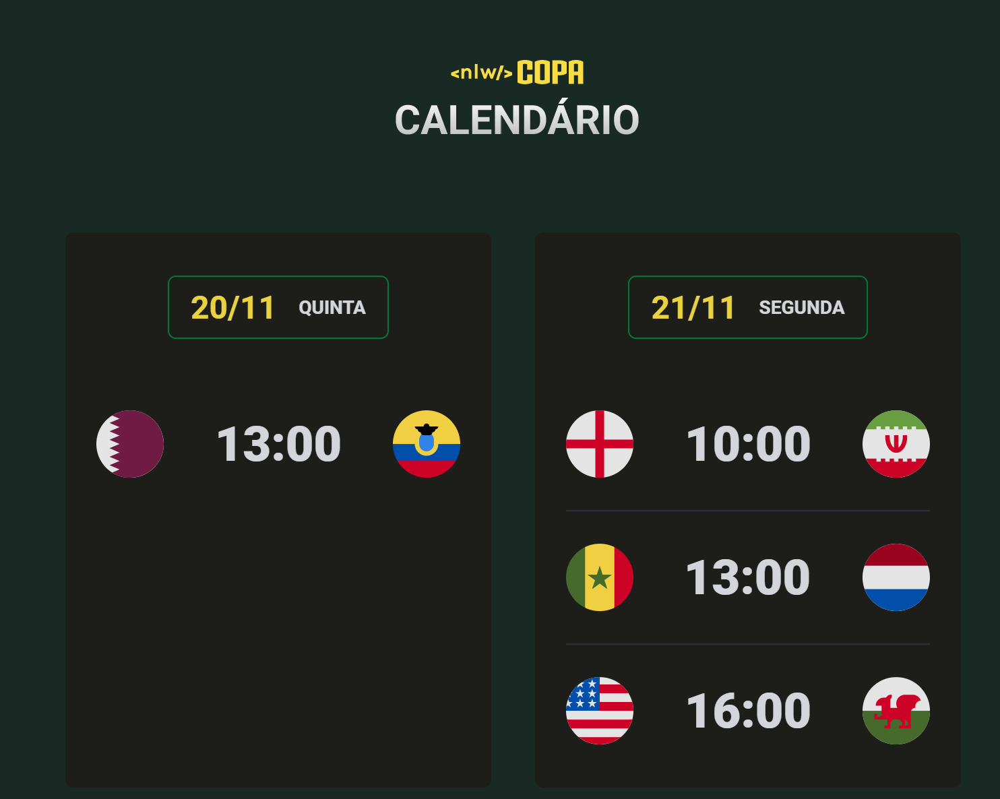

<h1 align="center">
&nbsp;&nbsp;&nbsp;|<strong> NLW - #10 </strong> |&nbsp;&nbsp;&nbsp;
</h1>
<h1 align="center">
&nbsp;&nbsp;&nbsp;|<strong> origins </strong> |&nbsp;&nbsp;&nbsp;
</h1>
<h1 align="center">
&nbsp;&nbsp;&nbsp;|<strong> WORLD CUP CALLENDAR </strong> |&nbsp;&nbsp;&nbsp;
</h1>

# **what?**

We developed the 2022's FIFA World Cup Callendar!

# **Index**

- [Main Technologies](#Tecnologias)
- [Expectations and Acomplishments](#Expectations-and-Acomplishments)
- [Developers](#Developers)

# **Technogies**

# **Expectations and Acomplishments**

During november`22, the world will stop to watch the FIFA World Cup @ Catar. That said, the RocketSeat school decided to create and event (Next Level Week) with the main mission to develop an callendar that will cover all teams games.

This is the result:
 

# **Developers**

> Estas pessoas contribuiram para o Readme.md ser o mais completo possível!

| <a href="https://github.com/Auriflanos" target="_blank">**Lucas Gonçalves**</a> |
| :---:
| <a href="https://github.com/Auriflanos" target="_blank">**_Owner_**</a> |
||
| <a href="https://www.linkedin.com/in/lucasrgoncalves/" target="_blank">`LinkedIn`</a> |
| <a href="https://github.com/Auriflanos" target="_blank">`GitHub`</a> |
